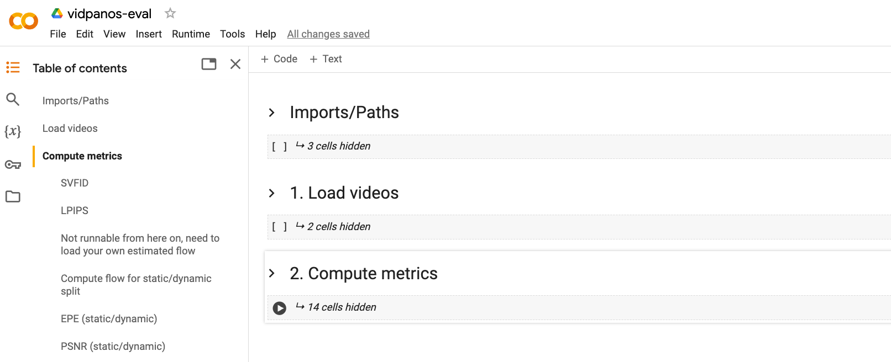

## VidPanos: Generative Panoramic Videos from Casual Panning Videos
#### [Project Page](https://jingweim.github.io/vidpanos/) | [Video](https://www.youtube.com/watch?v=93HHOnISoqk) | [arXiv](https://arxiv.org) | [Paper](https://jingweim.github.io/vidpanos/static/pdfs/arxiv_v3.pdf) | [Colab(metrics)](https://colab.research.google.com/drive/1yPWg5-5iNkZBglD9m4yZxgDUoE27kfbX?usp=sharing)

This is the official repository for SIGGRAPH Asia 2024 paper, "VidPanos: Generative Panoramic Videos from Casual Panning Videos". We release our test videos and evaluation code as a benchmark for the Panoramic Video Completion task.

### Evaluation Code
We release an [evaluation colab](https://colab.research.google.com/drive/1yPWg5-5iNkZBglD9m4yZxgDUoE27kfbX?usp=sharing) and [relevant files](https://drive.google.com/drive/folders/1u03i6w5ZdwxBOQK2FsWC6el365ysHv2Z?usp=sharing) (result/gt videos) for running it.

### Test Videos
The synthetic/real input videos can be downloaded [here](https://drive.google.com/file/d/1drYHcr4vI3cs2IZwwo0KNJJHx8o8CMpq/view?usp=sharing).

#### Directory Structure
<pre>
data/                        
    real/                                            # real/captured videos
        VID_20160323_102236_01/                      # video #1
            original/                                # panning input video
                frame_0000.jpg                       # individual frames
                frame_0001.jpg
                ...
            registered/                              # input video projected onto panoramic canvas (individual frames)
                warped_0000.jpg                      # individual frames, rgba, mask in alpha channel
                warped_0001.jpg
                ...
        VID_20160326_121131_01/                      # video #2
        ...
    synthetic/                                       # synthetic panning videos (360 video center-cropped and masked)
        bKsBG43rstY_start=00300_end=00476/           # video #1
            full_frames/                             # full video before masking
                0000.png                             # individual frames
                0001.png
                ...
            input/                                   # masked to synthesize camera panning
                0000.png                             # individual frames, rgba, mask in alpha channel
                0001.png
                ...
        GZigq4DDYyg_start=00000_end=00176/           # video #2
        ...
</pre>

